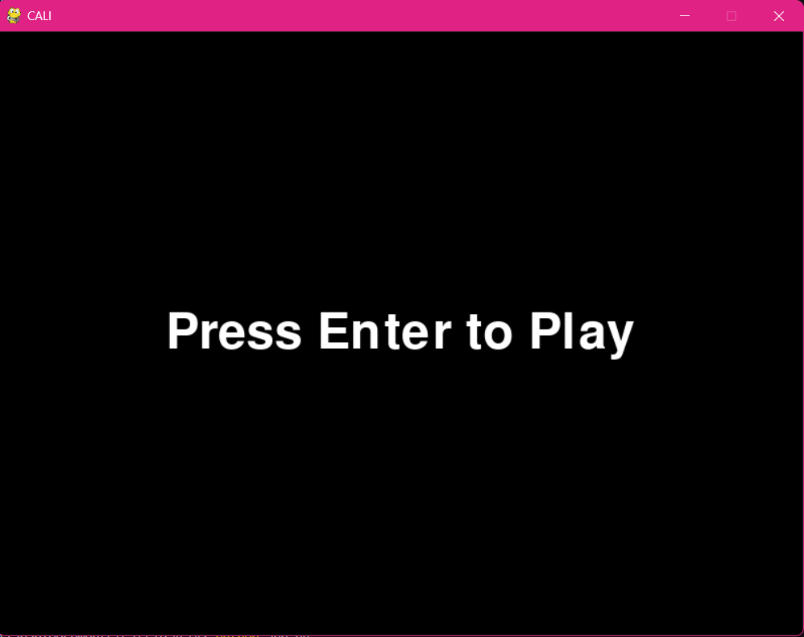
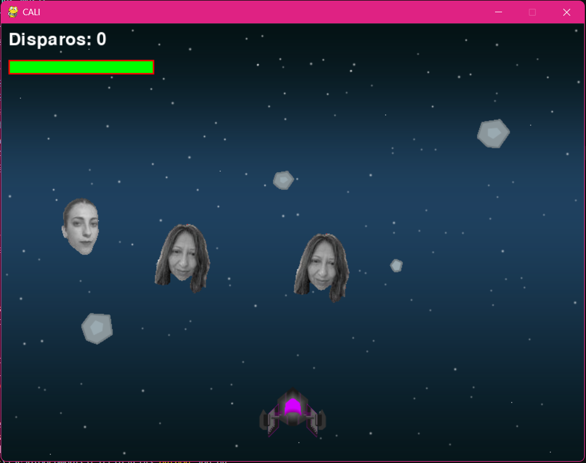
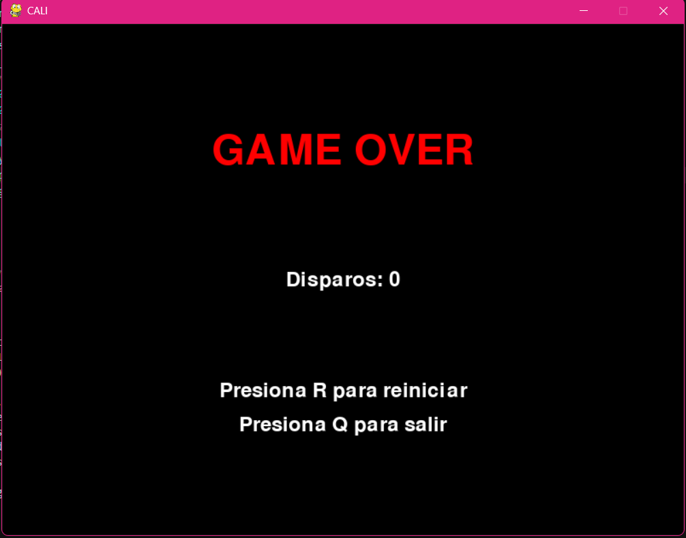

# ☄️ CALIA Meteors

### 👥 Integrantes

Iara Fernandez
Carolina Lopez
Lara Magallanes
Adriana Antunez
---

### 🎯 Descripción del Proyecto

Versión reinventada del clásico videojuego “Anti-Aircraft” donde una nave debe disparar a meteoros que llevan las caras de los integrantes, evitando que choquen contra ella.

## Capturas de Pantalla

  
  


## Demostración del Juego
[Toca para ver el video](https://youtu.be/697w31Fl3I4)

### Reglas Básicas del Juego

1. **Objetivo:**  
   Destruir todos los meteoros que bajan antes de que choquen con tu nave.

2. **Controles:**  
   - ⬅️ Flecha izquierda: mover nave a la izquierda  
   - ➡️ Flecha derecha: mover nave a la derecha  
   - 🔫 Barra espaciadora: disparar  

3. **Puntaje:**  
   - +10 puntos por cada meteoro destruido.  
   - El marcador se muestra en pantalla en tiempo real.

4. **Fin del Juego:**  
   - Si un meteoro choca con tu nave, el juego termina.  
   - Aparece la pantalla de “Game Over” con el total de disparos realizados.  

5. **Reinicio:**  
   - Presionar **R** para reiniciar el juego.  
   - Presionar **Q** para salir.


### 🧩 Patrones de Diseño Aplicados

* **Factory Method**
  Centraliza la creación de meteoros (Meteor()), permitiendo instanciar nuevos objetos con una sola línea, sin preocuparse por su configuración interna. Así es fácil cambiar sus características sin tocar el resto del código.

* **Observer (Event-driven)**
  El bucle principal escucha eventos (teclado, cerrar ventana) y reacciona. Esto desacopla la lógica de entrada del usuario y hace el código más flexible y modular.

* **State Pattern**
  El juego tiene distintos estados: inicio (`show_start_screen()`), ejecución y finalización (`show_game_over_screen()`). Cada uno controla comportamiento y UI específicos, cambiando según las acciones del jugador.

* **Strategy**
  La función `check_laser_collisions()` maneja la lógica de colisiones como una estrategia independiente, para que pueda modificarse sin afectar otras partes del juego.

* **Command**
  El método `shoot()` del jugador encapsula la acción de disparar balas, organizando esa orden en un único lugar, mejorando claridad y reutilización.

* **Mediator (implícito)**
  Los grupos de sprites (`all_sprites`, `bullets`, etc.) actúan como mediadores que coordinan la interacción entre objetos sin que estos estén directamente acoplados.

* **Flyweight**
  Las balas (`Bullet`) son objetos livianos que se crean y destruyen frecuentemente, optimizando el uso de memoria y recursos.

* **Facade**
  Funciones como `draw_shield_bar()` simplifican y encapsulan la lógica de dibujo para que el resto del juego no se tenga que preocupar por detalles gráficos.

* **Singleton (gestión global)**
  La inicialización de Pygame, mixer y manejo de sonidos están centralizados para evitar múltiples instancias y gestionar recursos compartidos globalmente.

---

### ⚙️ Configuración del entorno

1. **Crear entorno virtual**

   * Linux/macOS:

     ```bash
     python3 -m venv <nombre_del_entorno>
     ```
   * Windows:

     ```powershell
     python -m venv <nombre_del_entorno>
     ```

2. **Activar entorno virtual**

   * Linux/macOS:

     ```bash
     source <nombre_del_entorno>/bin/activate
     ```
   * Windows:

     ```powershell
     <nombre_del_entorno>\Scripts\activate
     ```

3. **Clonar repositorio**

   ```bash
   git clone <url_del_repositorio>
   ```

4. **Entrar al directorio del proyecto**

   ```bash
   cd <nombre_del_proyecto>
   ```

5. **Instalar pygame**

   ```bash
   pip install pygame
   ```

6. **Ejecutar la aplicación**

   ```bash
   python app.py
   ```
